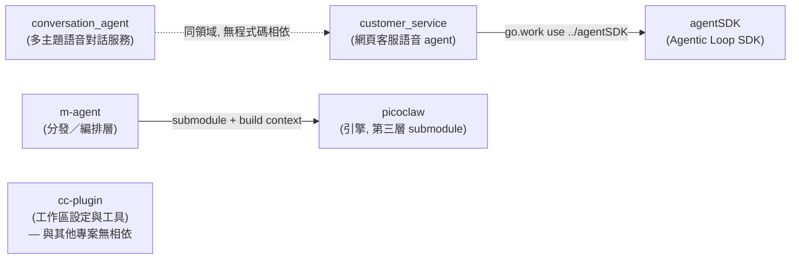

# ai — AI 代理與工作區工具分類 (AI Agents & Workspace Tooling)

本分類收`會自己跑一段推理迴圈的東西`，以及`讓這些迴圈更好寫的工具`：

- 通用的 agent 框架（`agentSDK`）
- 直接面對終端使用者的語音 agent 產品（`conversation_agent`、`customer_service`）
- 既有 agent 引擎的分發與編排層（`m-agent`）
- 讓 AI 編碼代理本身更好用的工作區設定與工具（`cc-plugin`）

`ai/` 本身是`容器 (container)`，不放任何程式碼；每個專案是獨立 git repo，
以 git submodule 掛在本目錄下，各自持有完整的統一介面 (Unified Interface) 文件。

## 專案清單 (Projects)

| 專案 | 一句話用途 | 主要技術 | 型態 |
| ---- | ---- | ---- | ---- |
| [agentSDK](agentSDK/) | 以`宣告式設定`組裝目標導向控制迴圈 (Goal-directed Control Loop) 的 Go Agentic Loop SDK；應用層宣告要開哪些能力，SDK 負責怎麼接 | Go（module `github.com/bizshuk/agentsdk`），`go.work` 併入 9 個 sample module | submodule |
| [cc-plugin](cc-plugin/) | `Claude Code` 與其他 AI 編碼代理的全域設定配置庫，集中管理 plugins / skills / agents，並內建 Go 實作的記憶蒸餾管道 (Distiller Pipeline) | Go CLI + Markdown plugins/skills，pm2 (`ecosystem.config.js`) | submodule |
| [conversation_agent](conversation_agent/) | 多主題 AI 語音對話服務：以 `Gemini Live API` 原生語音即時回答，內容型問題受知識庫約束、時長由 server 強制限制 | Go + `google.golang.org/genai` + pgvector；前端 Vite + TypeScript | submodule |
| [customer_service](customer_service/) | 網頁客服語音 agent：使用者以語音提問產品問題，只在 `scope/` 定義的範圍內回答，範圍外回固定文案 | Go + `bizshuk/agentsdk`；語音走 `ElevenLabs` (STT/TTS) 與 `MiniMax` (TTS) 級聯 | submodule |
| [m-agent](m-agent/) | `picoclaw` 引擎之上的分發／編排層，只放 customized 的編排、設定與測試資產 | Docker Compose + Python 測試 harness；引擎 `picoclaw` 為 Go（第三層 submodule） | submodule |
| `model/` | 空目錄，未偵測到內容 (Not detected) | — | plain dir |

## 專案關聯 (Project Relationships)

- `customer_service` → `agentSDK`：唯一的`程式碼層相依`。`customer_service/go.work`
  以 `use ../agentSDK` 併入，程式碼直接 import `agentsdk/{agent, core, provider}`
  與 `provider/{anthropic, elevenlabs, minimax}`。`agentsdk` 未發布，
  因此 `customer_service/go.mod` 沒有對應的 `require` —— 相依由 `go.work` 解析，
  `agentSDK` submodule 沒 init 就 build 不起來。
- `conversation_agent` ↔ `customer_service`：`同業務領域、不同引擎`，彼此無相依。
  前者以 Gemini Live 原生語音直連（speech-to-speech），後者以 agentsdk 驅動推理
  並用級聯 (cascade) STT/TTS 組出語音層。兩者的 scope 約束與 session 時長硬限制
  是相似的產品承諾，實作各自獨立。
- `m-agent` → `picoclaw`：本分類唯一的`三層結構`。引擎是 `sipeed/picoclaw` 的
  fork，m-agent 只疊薄薄一層編排，讓引擎 submodule 保持純淨可追上游。
- `cc-plugin`：與其他專案`無 build-time 相依`。它的產出是工作區層級的
  Claude Code 設定與技能，作用對象是`開發這些專案的代理`，不是這些專案的執行期。
